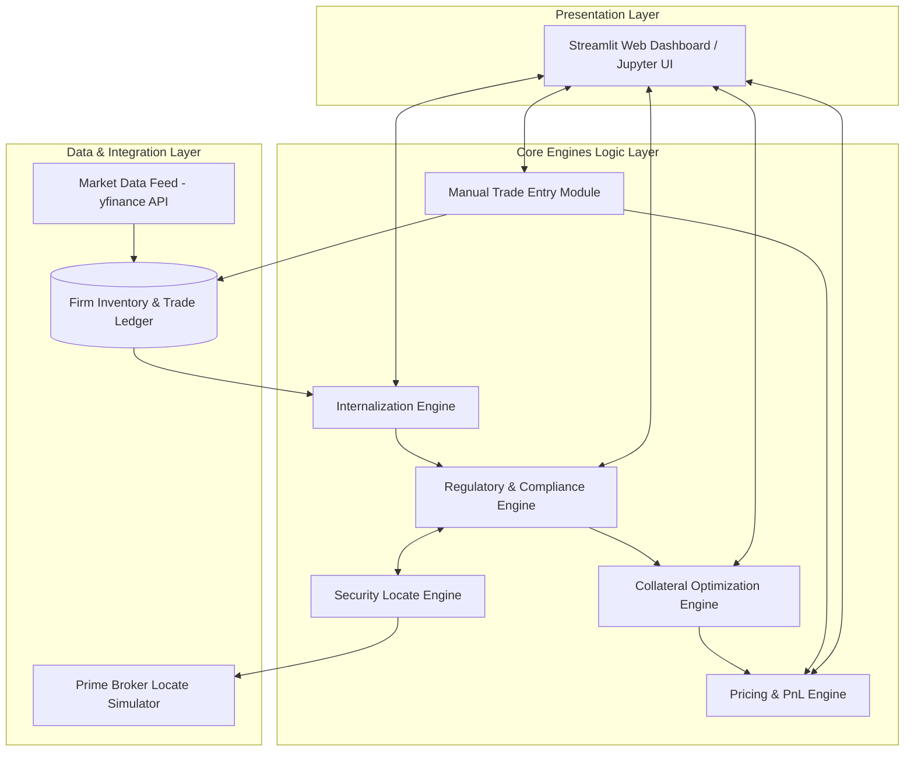
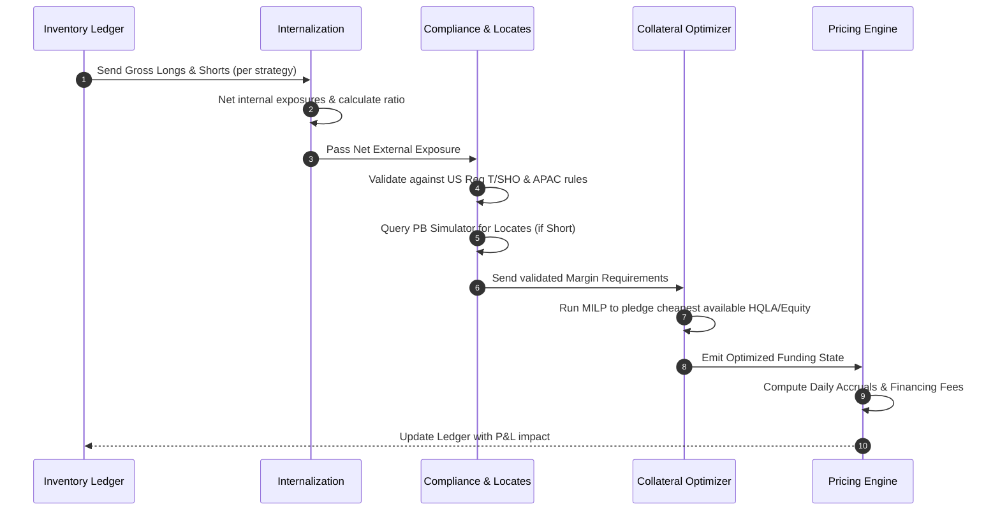
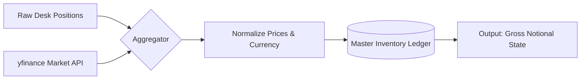
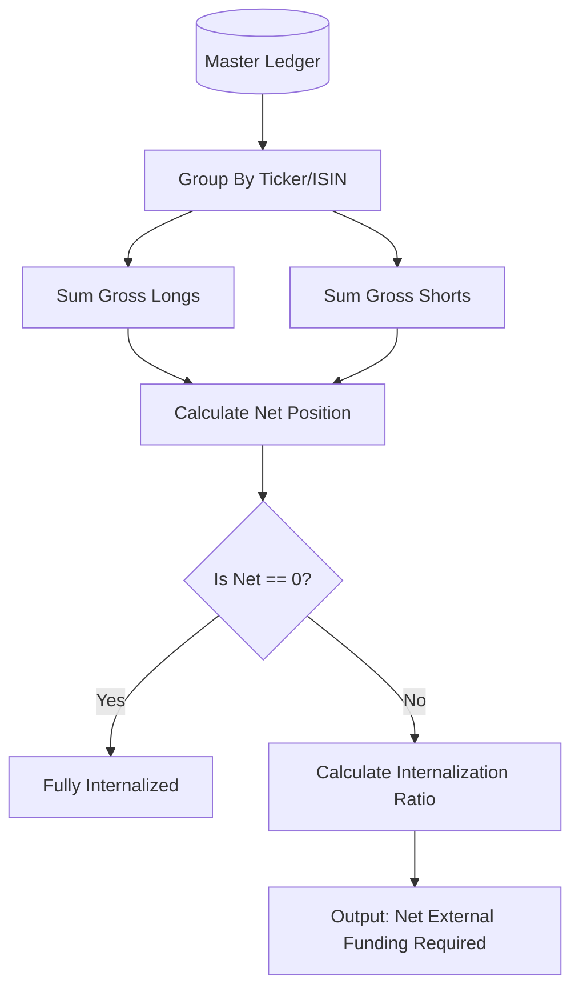
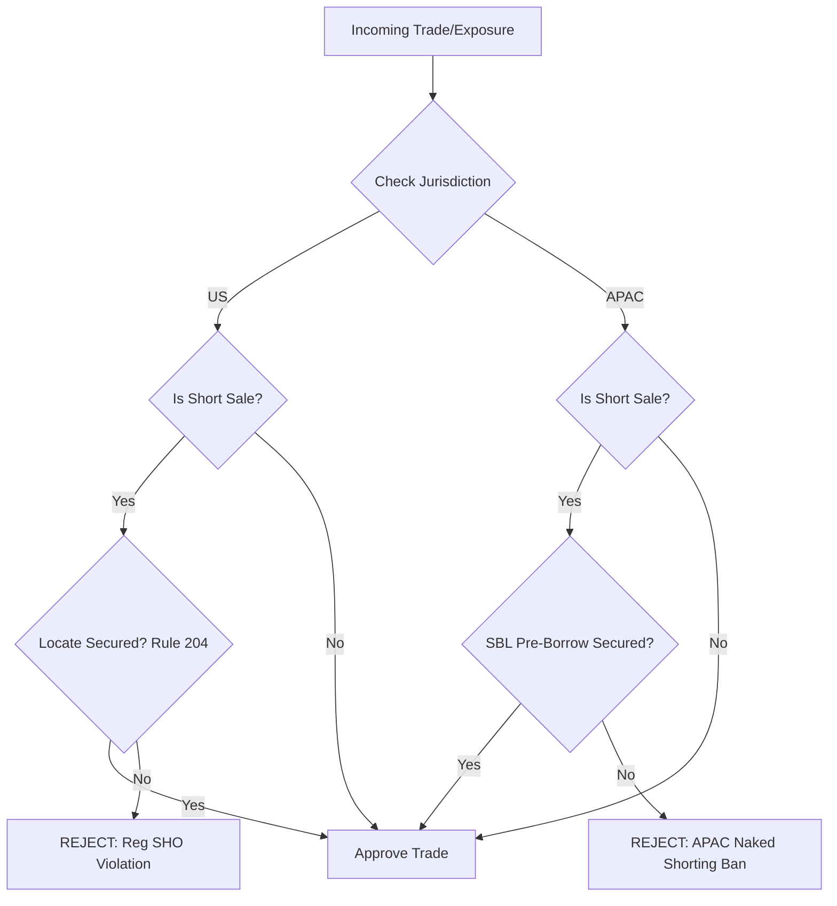
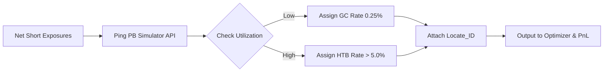
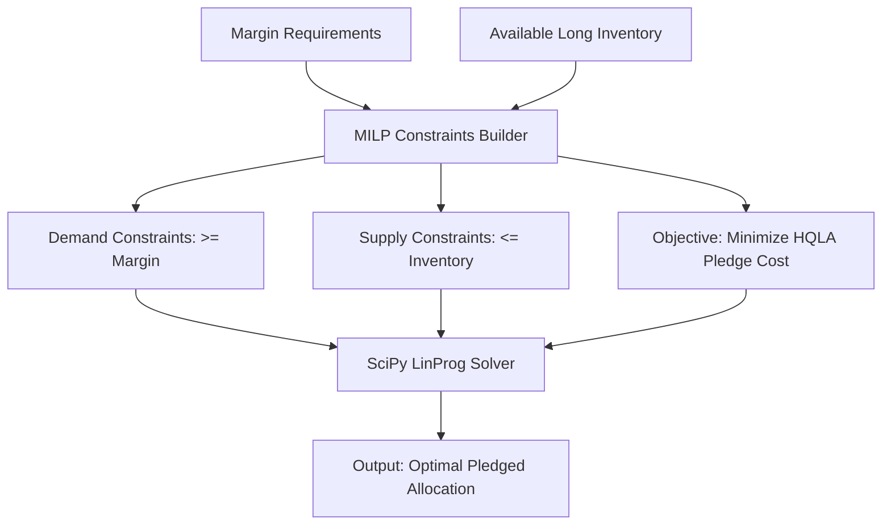
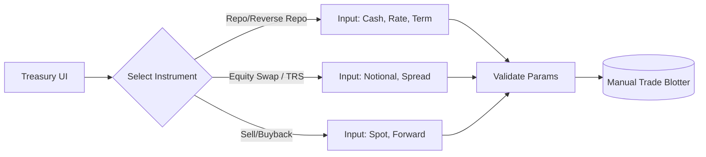
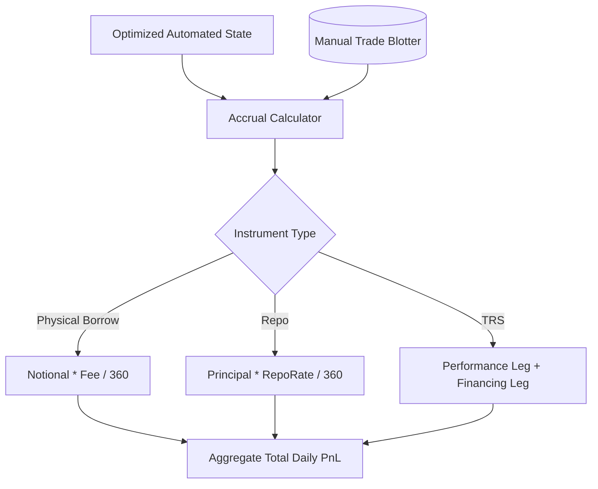

# Portfolio Financing System

This document outlines the architecture and implementation plan for the **Automated Portfolio Financing System**, serving as a blueprint for both the interactive Jupyter Notebook prototype and the web-based front-end production suite.

## Goal Description
Build an Automated Portfolio Financing system that functions similarly to an Automated Market Maker (AMM). The system autonomously calculates net exposure, allocates optimal collateral, tracks P&L, simulates market conditions, and ensures **cross-border regulatory compliance**. 

Manual intervention is explicitly supported via a comprehensive **Manual Trade Entry Module**, accommodating a full suite of financing instruments (Equity/Bond Borrowing, Repo, Swaps, Sell/Buybacks, etc.).

## Unified Product Specification
For complete documentation, zoom-in workflow diagrams, mathematical models, and compliance rules covering the entire system, please refer to the specification below.


## Product Overview

```text
portfolio_financing/
│
├── main.py                 # The automated pipeline runner (orchestrator)
├── requirements.txt        # Dependencies (pandas, scipy, yfinance, streamlit, pytest)
│
├── src/
│   ├── __init__.py
│   ├── inventory.py        # Manages positions, market data (yfinance)
│   ├── internalization.py  # Internalization mathematical logic
│   ├── compliance.py       # US (Reg T/SHO) & APAC (SFC/FSA/MAS) Rule Engine
│   ├── optimizer.py        # MILP/LP Collateral Optimization engine
│   ├── locates.py          # Borrow rate simulation & Reg SHO locate checks
│   ├── manual_trades.py    # Manual trade booking & blotter management
│   └── pnl.py              # Exact pricing math for Repo, TRS, Borrowing, etc.
│
├── tests/
│   ├── __init__.py
│   └── test_engines.py     # Comprehensive automated test suite (pytest)
│
└── app/
    └── dashboard.py        # Streamlit web application for the UI
```


# Automated Portfolio Financing System: Functional & Technical Specification

This document serves as the unified master specification for the Automated Portfolio Financing Product Suite. It details both the functional requirements (business logic) and technical specifications (mathematical and programmatic logic) for all system modules, accompanied by architectural diagrams and concrete business examples to facilitate understanding and validate testing.

---

## Chapter 1: System Overview

The Automated Portfolio Financing System operates akin to an Automated Market Maker (AMM) for a multi-strategy quantitative proprietary trading firm. It autonomously manages inventory, internalizes cross-strategy exposures, secures external locates, ensures cross-border regulatory compliance, optimally allocates collateral, and processes daily financing P&L.

### 1.1 System Architecture



### 1.2 Functional Workflow (Data Flow Context)



---

## Chapter 2: Inventory & Market Data Module
### 2.1 Functional Specification
Acts as the single source of truth for the firm's positions. It aggregates positions across multiple independent trading desks and enriches them with live market data to determine real-time Notional Values.

### 2.2 Module Zoom-In Workflow


### 2.3 Technical Specification
*   **Data Source Integration**: Fetches end-of-day or live prices via the `yfinance` API.
*   **Schema**: `[Trade_ID, Strategy, Ticker, ISIN, AssetClass, Jurisdiction, Quantity, MtM_Price, Notional]`.
*   **Notional Calculation**: $Notional = \text{Quantity} \times \text{MtM}_{Price}$.

### 2.4 Business Example
*   **Scenario**: The firm holds 10,000 shares of AAPL (StatArb) and is short 4,000 shares of AAPL (VolArb). AAPL is trading at $150.
*   **Output**: The ledger records a gross long notional of $1,500,000 and a gross short notional of -$600,000.

---

## Chapter 3: Internalization Engine
### 3.1 Functional Specification
Reduces the firm's reliance on external Street financing by automatically netting opposing positions held by different internal desks.

### 3.2 Module Zoom-In Workflow


### 3.3 Technical Specification
*   **Net Exposure**: $Net\_Quantity_i = \sum_{desk} Quantity_{i, desk}$
*   **Internalization Ratio Calculation**: 
    \[ \text{Internalization Ratio} = 1 - \frac{\sum |Net\_Quantity_i|}{\sum |Gross\_Quantity_i|} \]

### 3.4 Business Example
*   **Scenario**: StatArb is Long 10,000 AAPL and VolArb is Short 4,000 AAPL. 
*   **Execution**: The engine nets these to an external requirement of **Long 6,000 AAPL**. 
*   **Validation**: 4,000 shares internalized. Ratio for AAPL is $1 - (6000 / 14000) = 42.8\%$.

---

## Chapter 4: Regulatory & Compliance Engine
### 4.1 Functional Specification
A firewall validating netted exposures and manual trades against cross-border regulatory frameworks.

### 4.2 Module Zoom-In Workflow


### 4.3 Technical Specification
*   **US Reg SHO**: For any $Net\_Quantity < 0$ where `Jurisdiction == 'US'`, `Locate_Secured` must be `True`.
*   **APAC Naked Short Ban**: For jurisdictions `['HK', 'JP', 'SG', 'AU']`, short sales strictly require `SBL_PreBorrow_Secured == True`.

### 4.4 Business Example
*   **Scenario**: PM manually enters short sale for 50,000 shares of 0700.HK without an SBL pre-borrow.
*   **Validation**: Engine evaluates `Jurisdiction == 'HK'`, detects `SBL_PreBorrow_Secured == False`, and blocks the trade.

---

## Chapter 5: Security Locate Engine
### 5.1 Functional Specification
Interfaces with external Prime Brokers to source borrows for net short positions, assigning General Collateral (GC) or Hard-to-Borrow (HTB) rates.

### 5.2 Module Zoom-In Workflow


### 5.3 Technical Specification
*   **Rate Assignment**: GC rates $0.25\% - 0.75\%$. HTB rates scale dynamically up to $20.00\%$.

### 5.4 Business Example
*   **Scenario**: Firm needs to short 10,000 shares of a meme stock. 
*   **Validation**: Returns `Locate_ID = 987654` with HTB borrow fee rate of $12.50\%$.

---

## Chapter 6: Collateral Optimization Engine (MILP)
### 6.1 Functional Specification
Determines the cheapest mathematically possible way to satisfy external margin requirements using available long inventory, preserving High-Quality Liquid Assets (HQLA).

### 6.2 Module Zoom-In Workflow


### 6.3 Technical Specification
*   **Decision Variable ($x_{ij}$)**: Amount of asset $i$ pledged to counterparty $j$.
*   **Cost Vector ($c_i$)**: HQLA penalty ($c = 0.05$); Equities low cost ($c = 0.01$).
*   **Objective**: Minimize $\sum (c_i \times x_{ij})$
*   **Demand Constraint**: $\sum_i x_{ij} \times (1 - Haircut_i) \ge Margin\_Req_j$

### 6.4 Business Example
*   **Scenario**: Firm must post $1M margin. Holds $2M Equities (10% haircut) and $2M US Treasuries (2% haircut).
*   **Validation**: Optimizer chooses to pledge $1.11M of Equities ($c=0.01$). After 10% haircut, yields $1M margin. Treasuries ($c=0.05$) are saved.

---

## Chapter 7: Manual Trade Entry Module
### 7.1 Functional Specification
Provides a UI override for the Treasury desk to manually book physical and synthetic financing trades, bypassing the automated internalization netting.

### 7.2 Module Zoom-In Workflow


### 7.3 Technical Specification
Supports the precise booking of:
*   **Repo / Reverse Repo**
*   **Bond Sell Buyback**
*   **Total Return Swap (TRS)**

### 7.4 Business Example
*   **Scenario**: Treasury inputs `$5,000,000` Repo pledging `AGG` at `5.25%`.
*   **Validation**: Blotter updates immediately, locking `AGG` from the Collateral Optimizer.

---

## Chapter 8: Pricing & P&L Engine
### 8.1 Functional Specification
Calculates the daily accruals, interest expenses, borrow fees, and synthetic leg performances for the entire portfolio.

### 8.2 Module Zoom-In Workflow


### 8.3 Technical Specification
Uses `Actual/360` day count.
*   **Fee-Based Borrowing**: $PnL_{daily} = - \left( \frac{\text{Notional} \times \text{Fee\_Rate}}{360} \right)$
*   **TRS Long Exposure**: 
    $PnL_{total} = (\text{Quantity} \times \Delta \text{Price}) - \left( \frac{\text{Notional} \times (\text{SOFR} + \text{Spread})}{360} \right)$

### 8.4 Business Example
*   **Scenario**: TRS Long 10,000 TSLA. Price $200. Financing 5.50%. TSLA rises to $205.
*   **Validation**: Performance Leg: $+\$50,000$. Financing Leg: $-\$305.55$. Total: $+\$49,694.45$.
